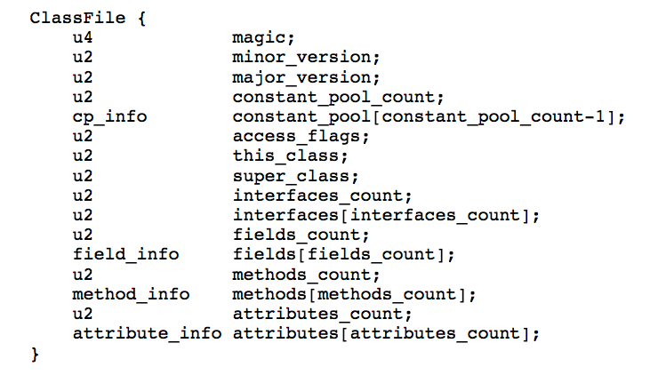
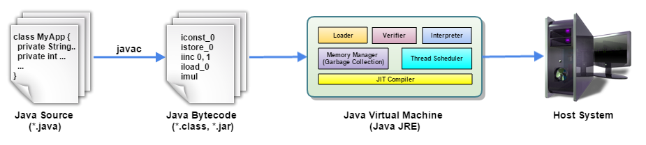
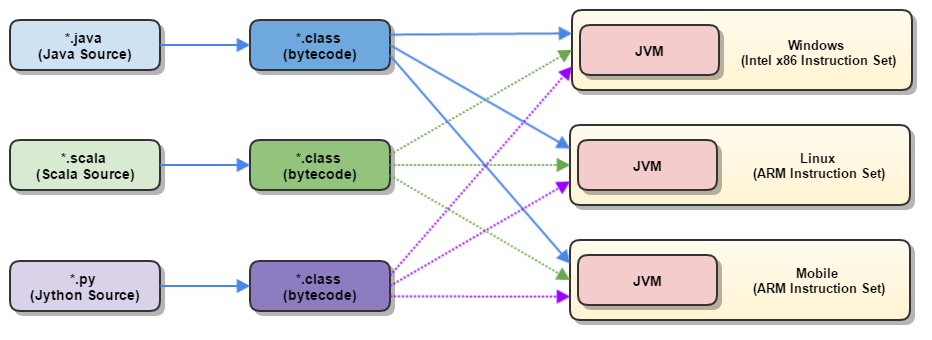

[[proxy]]
== 代理模式

=== 定义

[quote,{bkn_dp}]
____
代理模式（Proxy）::
为其他对象提供一种代理以控制这个对象的访问。
____

=== 类图

plantuml::./puml/proxy.puml[target={puml_target_dir}/proxy,{puml_attr}]

Subject类，定义了RealSubject和Proxy的共用接口，这样就在任何使用RealSubject的地方都可以使用Proxy。

=== 静态代理模式

[source,{java_source_attr}]
.proxy/Subject.java 类
[[src-proxy-subject]]
----
include::{source_dir}/proxy/Subject.java[]
----

RealSubject类，定义Proxy所代表的真实实体。

[source,{java_source_attr}]
.proxy/RealSubject.java 类
[[src-proxy-realsubject]]
----
include::{source_dir}/proxy/RealSubject.java[]
----

Proxy类，保存一个引用使得代理可以访问实体，并提供一个与Subject的接口相同的接口，这样代理就可以用来替代实体。

[source,{java_source_attr}]
.proxy/Proxy.java 类
[[src-proxy-proxy]]
----
include::{source_dir}/proxy/Proxy.java[]
----

[source,{java_source_attr}]
.proxy/Client.java 类
[[src-proxy-client]]
----
include::{source_dir}/proxy/Client.java[]
----

==== 再来一个例子…

[source,{java_source_attr}]
.proxy/UserService.java 类
[[src-proxy-userservice]]
----
include::{source_dir}/proxy/UserService.java[]
----

[source,{java_source_attr}]
.proxy/UserServiceImpl.java 类
[[src-proxy-userserviceimpl]]
----
include::{source_dir}/proxy/UserServiceImpl.java[]
----

[source,{java_source_attr}]
.proxy/UserServiceAuthenticationProxy.java 类
[[src-proxy-userserviceauthenticationproxy]]
----
include::{source_dir}/proxy/UserServiceAuthenticationProxy.java[]
----

[source,{java_source_attr}]
.proxy/UserServiceProxyMain.java 类
[[src-proxy-UserServiceProxyMain]]
----
include::{source_dir}/proxy/UserServiceProxyMain.java[]
----

[WARNING]
====
*请思考：*

到现在为止，你们发现什么问题了吗？

代理模式这样实现有什么问题吗？还有其他改进空间吗？？
====

// include::_separator.adoc[]

=== 动态代理

*画图说明调用流程，然后再来进行下一步讲解*

[source,{java_source_attr}]
.proxy/ProfilerInvocationHandler.java 类
[[src-proxy-ProfilerInvocationHandler]]
----
include::{source_dir}/proxy/ProfilerInvocationHandler.java[]
----

[source,{java_source_attr}]
.proxy/LoggerInvocationHandler.java 类
[[src-proxy-LoggerInvocationHandler]]
----
include::{source_dir}/proxy/LoggerInvocationHandler.java[]
----

[source,{java_source_attr}]
.proxy/UserServiceDynamicProxyMain.java 类
[[src-proxy-UserServiceDynamicProxyMain]]
----
include::{source_dir}/proxy/UserServiceDynamicProxyMain.java[]
----

流程与这个类似这样的，还有 Java Web 中的 `Filter`， Spring MVC 中的 ``

[WARNING]
====
*请思考：*

代理模式这样实现有什么问题吗？还有其他改进空间吗？？
====

// include::_separator.adoc[]

=== 来个黑魔法…

[source,{java_source_attr}]
.proxy/asm/Account.java 类
[[src-proxy-asm-account]]
----
include::{source_dir}/proxy/asm/Account.java[]
----

我们来看一下，编译后生成的文件……

[source,bash]
----
cd /Users/diguage/Documents/wiki.diguage.com/java/deep-in-design-patterns/target/classes/com/diguage/didp/proxy/asm

vim /Users/diguage/Documents/wiki.diguage.com/java/deep-in-design-patterns/target/classes/com/diguage/didp/proxy/asm/Account.class

:%!xxd

javap -v /Users/diguage/Documents/wiki.diguage.com/java/deep-in-design-patterns/target/classes/com/diguage/didp/proxy/asm/Account.class

----

Java 虚拟机规范中，对 Java  Class 文件格式的定义： https://docs.oracle.com/javase/specs/jvms/se8/html/jvms-4.html[Chapter 4. The class File Format]

Java 虚拟机规范中，对 Java 方法表格式的定义： https://docs.oracle.com/javase/specs/jvms/se8/html/jvms-4.html#jvms-4.6[Chapter 4. The class File Format]

image::images/java-class-file-format-method-info.png[title="Java Class文件格式-方法表格式", alt="Java Class文件格式-方法表格式"]

image::images/jvm-language-compilation-process.png[title="JVM 语言", alt="JVM 语言"]

. https://coolshell.cn/articles/9229.html[实例分析Java Class的文件结构 | 酷 壳 - CoolShell]
. https://my.oschina.net/sulliy/blog/61133[利用javap反编译Scala字节码文件 - 咩咩声 不绝于耳]
. https://avaldes.com/java-virtual-machine/[Java Virtual Machine]
. https://www.safaribooksonline.com/library/view/client-server-web-apps/9781449369323/ch04.html[4. Java Tools - Client-Server Web Apps with JavaScript and Java [Book]]
. http://tutorials.jenkov.com/java-concurrency/java-memory-model.html[Java Memory Model]

时间统计类……

[source,{java_source_attr}]
.proxy/asm/Profiler.java 类
[[src-proxy-asm-Profiler]]
----
include::{source_dir}/proxy/asm/Profiler.java[]
----

修改字节码，在每个方法的开始部分和返回部分来插入我们的时间统计代码……

[source,{java_source_attr}]
.proxy/asm/ProfilerMethodAdapter.java 类
[[src-proxy-asm-ProfilerMethodAdapter]]
----
include::{source_dir}/proxy/asm/ProfilerMethodAdapter.java[]
----

[source,{java_source_attr}]
.proxy/asm/ProfilerClassAdapter.java 类
[[src-proxy-asm-ProfilerClassAdapter]]
----
include::{source_dir}/proxy/asm/ProfilerClassAdapter.java[]
----

[source,{java_source_attr}]
.proxy/asm/ProfilerWeaveMain.java 类
[[src-proxy-asm-ProfilerWeaveMain]]
----
include::{source_dir}/proxy/asm/ProfilerWeaveMain.java[]
----

再来运行一下看看…

[source,{java_source_attr}]
.proxy/asm/AfterWeaveProfilerMain.java 类
[[src-proxy-asm-AfterWeaveProfilerMain]]
----
include::{source_dir}/proxy/asm/AfterWeaveProfilerMain.java[]
----

[WARNING]
====
在使用 ASM 生成代理 class 文件时，发现确定类文件的路径是个大问题。这里需要注意的是针对 file 的 URL 格式规范。

* https://en.wikipedia.org/wiki/File_URI_scheme[file URI scheme]
* http://stackoverflow.com/questions/13869526/is-a-file-path-a-url[Is a “file://” path a URL?]
* http://www.iana.org/assignments/uri-schemes/uri-schemes.xhtml[Uniform Resource Identifier (URI) Schemes]
* http://www.rfc-editor.org/rfc/rfc1738.txt[RFC1738: Uniform Resource Locators (URL)]
====

[WARNING]
====
*请思考：*

代理模式这样实现有什么问题吗？还有其他改进空间吗？？
====

// include::_separator.adoc[]

=== 来点通俗易懂的…

用 Byte Buddy 来搞…

[source,{java_source_attr}]
.proxy/bytebuddy/ProfilerAnnotationInterceptor.java 类
[[src-proxy-bytebuddy-ProfilerAnnotationInterceptor]]
----
include::{source_dir}/proxy/bytebuddy/ProfilerAnnotationInterceptor.java[]
----

[source,{java_source_attr}]
.proxy/bytebuddy/ProflierAnnotationAgent.java 类
[[src-proxy-bytebuddy-ProflierAnnotationAgent]]
----
include::{source_dir}/proxy/bytebuddy/ProflierAnnotationAgent.java[]
----

==== 再来一组更简单的…

[source,{java_source_attr}]
.proxy/bytebuddy/ProfilerInterceptor.java 类
[[src-proxy-bytebuddy-ProfilerInterceptor]]
----
include::{source_dir}/proxy/bytebuddy/ProfilerInterceptor.java[]
----

[source,{java_source_attr}]
.proxy/bytebuddy/ProflierAgent.java 类
[[src-proxy-bytebuddy-ProflierAgent]]
----
include::{source_dir}/proxy/bytebuddy/ProflierAgent.java[]
----

[WARNING]
====
*请思考：*

代理模式这样实现有什么问题吗？还有其他改进空间吗？？
====

https://blog.newrelic.com/2014/09/29/diving-bytecode-manipulation-creating-audit-log-asm-javassist/[Manipulating Bytecode with ASM and Javassist - New Relic blog]

// include::_separator.adoc[]

=== 可不可更透明点…

[source,{java_source_attr}]
.proxy/agent/PreMainAddTimeStatAgent.java 类
[[src-proxy-agent-premainaddtimestatagent]]
----
include::{source_dir}/proxy/agent/PreMainAddTimeStatAgent.java[]
----

[source,{java_source_attr}]
.proxy/agent/RunAccountMain.java 类
[[src-proxy-agent-runaccountmain]]
----
include::{source_dir}/proxy/agent/RunAccountMain.java[]
----

[source,bash]
----
# 运行
java -cp .:/Users/diguage/develop/tools/MavenRepository/org/ow2/asm/asm-all/5.2/asm-all-5.2.jar -javaagent:target/deep-in-design-patterns-0.0.1.jar com.diguage.didp.proxy.agent.RunAccountMain

java -cp .:/Users/diguage/develop/tools/MavenRepository/net/bytebuddy/byte-buddy/1.8.0/byte-buddy-1.8.0.jar -javaagent:target/deep-in-design-patterns-0.0.1.jar com.diguage.didp.proxy.agent.RunAccountMain
----

[WARNING]
====
*请思考：*

代理模式这样实现有什么问题吗？还有其他改进空间吗？应用上线后怎么搞？
====

. https://zeroturnaround.com/rebellabs/how-to-inspect-classes-in-your-jvm/[How-to guide to writing a javaagent | zeroturnaround.com]
. https://liuzhengyang.github.io/2017/03/15/javaagent/[javaagent | 刘正阳]
. https://ivanyu.me/blog/2017/11/04/java-agents-javassist-and-byte-buddy/[Java agents, Javassist and Byte Buddy | Ivan Yurchenko]
. https://www.infoq.com/articles/Easily-Create-Java-Agents-with-ByteBuddy[Easily Create Java Agents with Byte Buddy]
. https://zeroturnaround.com/rebellabs/testing-the-performance-of-4-java-runtime-code-generators-cglib-javassist-jdk-proxy-byte-buddy/[Performance comparison of Java Runtime Code Generation Libraries zeroturnaround.com]

=== Java 应用上线后…

BTrace

=== 作用

一般来说分为几种

* 第一种应用是远程代理，也就是为一个对象在不同的地址空间提供局部代表。这样可以隐藏一个对象存在于不同地址空间的事实[DP]。
* 第二种应用是虚拟代理，是根据需要创建开销很大的对象。通过它来存放实例化需要很长时间的真实对象[DP]。
* 第三种应用是安全代理，用来控制真实对象访问时的权限[DP]。
* 第四种是智能指引，是指当调用真实的对象时，代理处理另外一些事[DP]。

代理模式其实就是在访问对象时引入一定程度的间接性，因为这种间接性，可以附加多种用途。

代理就是真实对象的代表。

. http://www.iteye.com/topic/1116696[AOP的实现机制]
